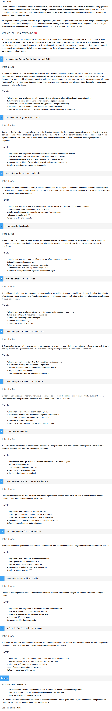

# Velocidade e Qualidade com Estruturas de Dados e Algoritmos

# TP2 - Questões (12)

# Modo de Uso:
- No projeto tem um arquivo pdf com todas as questões resolvidas com descrição das soluções implementadas
- No projeto constam também os arquivos python.py quando solicitado nas questões

 